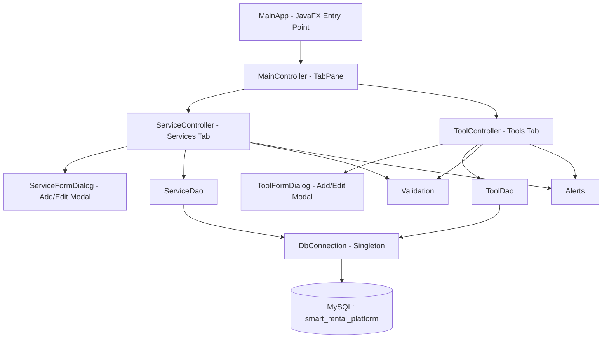

# Design Document: javafx-services-tools-crud

## Overview

A JavaFX desktop CRUD application that connects to a local MySQL database (`smart_rental_platform`) shared with a Symfony web application. The app exposes two modules — Services and Tools — each in its own tab. Users can list, add, edit, and delete records through a TableView and modal dialog forms. No schema changes are made to the database.

The application is built with Maven, uses JDBC directly (no ORM), and follows a layered architecture: UI → DAO → DB.

---

## Architecture



**Layer responsibilities:**

- `ui` — JavaFX controllers and dialogs; all user interaction
- `dao` — SQL execution via JDBC PreparedStatements; no business logic
- `db` — single shared `Connection` with validity check and reconnect
- `model` — plain POJOs matching DB columns
- `util` — stateless helpers: input validation and alert dialogs

**Threading model:**

- `findAll()` runs inside a JavaFX `Task<List<T>>` on a background thread
- Insert / update / delete are synchronous on the JavaFX Application Thread (triggered by user action, fast enough to not block UI)
- TableView is updated via `Platform.runLater` or `Task.setOnSucceeded`

---

## Components and Interfaces

### DbConnection (`tn.piapp.db`)

```java
public class DbConnection {
    private static DbConnection instance;
    private Connection connection;

    private DbConnection() { /* connect */ }

    public static DbConnection getInstance();
    public Connection getConnection();   // checks isValid(2), reconnects if stale
}
```

- JDBC URL: `jdbc:mysql://127.0.0.1:3306/smart_rental_platform`
- Credentials: `root` / `""` (empty password)
- On `getConnection()`: if `connection == null || !connection.isValid(2)` → call `connect()` again

### ServiceDao (`tn.piapp.dao`)

```java
public class ServiceDao {
    public List<Service> findAll() throws SQLException;
    public void insert(Service s) throws SQLException;
    public void update(Service s) throws SQLException;
    public void delete(int id) throws SQLException;
    public int resolveDefaultHostId() throws SQLException;  // SELECT MIN(id) FROM user
}
```

### ToolDao (`tn.piapp.dao`)

```java
public class ToolDao {
    public List<Tool> findAll() throws SQLException;
    public void insert(Tool t) throws SQLException;
    public void update(Tool t) throws SQLException;
    public void delete(int id) throws SQLException;
    public int resolveDefaultHostId() throws SQLException;  // SELECT MIN(id) FROM user
}
```

### Validation (`tn.piapp.util`)

```java
public class Validation {
    public static String validateService(Service s);  // returns error message or null
    public static String validateTool(Tool t);        // returns error message or null
}
```

Rules enforced:
- `name` not blank
- `basePrice >= 0`
- `durationMinutes > 0`
- `pricePerDay >= 0`
- `stockQuantity >= 0`

### Alerts (`tn.piapp.util`)

```java
public class Alerts {
    public static void showError(String title, String message);
    public static boolean showConfirmation(String title, String message); // returns true if OK
}
```

### ServiceController / ToolController (`tn.piapp.ui`)

Each controller owns:
- A `TableView<T>` with columns bound to model properties
- Add / Edit / Delete / Refresh `Button`s
- Edit and Delete buttons disabled when `tableView.getSelectionModel().getSelectedItem() == null`
- A `ProgressIndicator` shown while the background task runs

### ServiceFormDialog / ToolFormDialog (`tn.piapp.ui`)

- Extend `Dialog<T>` or wrap a `Stage` as a modal
- Fields: text fields for name, description, location, imageName; numeric fields for price/duration/stock; `CheckBox` for isActive
- On submit: call `Validation.validateService/Tool()`, show inline label if invalid, otherwise return the populated model object

---

## Data Models

### Service (`tn.piapp.model`)

```java
public class Service {
    private int id;
    private String name;
    private String description;       // nullable
    private BigDecimal basePrice;
    private int durationMinutes;
    private String location;          // nullable
    private boolean isActive;
    private LocalDateTime createdAt;
    private LocalDateTime updatedAt;
    private int hostId;
    private String imageName;         // nullable
    // getters + setters
}
```

### Tool (`tn.piapp.model`)

```java
public class Tool {
    private int id;
    private String name;
    private String description;       // nullable
    private BigDecimal pricePerDay;
    private int stockQuantity;
    private String location;          // nullable
    private boolean isActive;
    private LocalDateTime createdAt;
    private LocalDateTime updatedAt;
    private int hostId;
    private String imageName;         // nullable
    // getters + setters
}
```

**Column mapping notes:**
- `is_active` (TINYINT) ↔ `boolean isActive` — read via `rs.getInt("is_active") != 0`, written as `ps.setInt(?, isActive ? 1 : 0)`
- `created_at` / `updated_at` have no DB default — always set in Java to `LocalDateTime.now()` before INSERT; `updated_at` reset on UPDATE
- `category_id` — omitted entirely from all SQL and model fields
- `image_size`, `image_updated_at` — omitted entirely from all SQL and model fields
- `host_id` — resolved at runtime via `SELECT MIN(id) FROM user`; never shown in UI

---

## Correctness Properties

*A property is a characteristic or behavior that should hold true across all valid executions of a system — essentially, a formal statement about what the system should do. Properties serve as the bridge between human-readable specifications and machine-verifiable correctness guarantees.*

### Property 1: Connection resilience

*For any* `DbConnection` instance whose underlying `Connection` has been closed or invalidated, calling `getConnection()` should return a connection for which `isValid(2)` returns `true`.

**Validates: Requirements 1.4**

---

### Property 2: host_id is always resolved from the user table

*For any* Service or Tool inserted via the DAO, the `host_id` stored in the database should equal the value returned by `SELECT MIN(id) FROM user` at the time of insertion.

Edge case: when `SELECT MIN(id) FROM user` returns NULL (empty user table), the insert should be aborted and no row should be written.

**Validates: Requirements 2.2, 2.3**

---

### Property 3: Service insert round-trip

*For any* valid `Service` object (passing all validation rules), after calling `ServiceDao.insert(service)`, a subsequent `ServiceDao.findAll()` should contain a record whose `name`, `basePrice`, and `durationMinutes` match the inserted object.

**Validates: Requirements 3.3**

---

### Property 4: Service update round-trip

*For any* existing Service record and any valid updated field values, after calling `ServiceDao.update(service)`, a subsequent `ServiceDao.findAll()` should return the record with the updated values and no other records should be affected.

**Validates: Requirements 3.5**

---

### Property 5: Service delete removes record

*For any* existing Service `id`, after calling `ServiceDao.delete(id)`, a subsequent `ServiceDao.findAll()` should not contain any record with that `id`.

**Validates: Requirements 3.7**

---

### Property 6: Tool insert round-trip

*For any* valid `Tool` object (passing all validation rules), after calling `ToolDao.insert(tool)`, a subsequent `ToolDao.findAll()` should contain a record whose `name`, `pricePerDay`, and `stockQuantity` match the inserted object.

**Validates: Requirements 4.3**

---

### Property 7: Tool update round-trip

*For any* existing Tool record and any valid updated field values, after calling `ToolDao.update(tool)`, a subsequent `ToolDao.findAll()` should return the record with the updated values and no other records should be affected.

**Validates: Requirements 4.5**

---

### Property 8: Tool delete removes record

*For any* existing Tool `id`, after calling `ToolDao.delete(id)`, a subsequent `ToolDao.findAll()` should not contain any record with that `id`.

**Validates: Requirements 4.7**

---

### Property 9: Blank name is always invalid

*For any* string composed entirely of whitespace characters (including the empty string), `Validation.validateService()` and `Validation.validateTool()` should both return a non-null, non-empty error message.

**Validates: Requirements 5.1**

---

### Property 10: Negative numeric fields are always invalid

*For any* Service with `basePrice < 0`, `Validation.validateService()` should return a non-null error. *For any* Service with `durationMinutes <= 0`, `Validation.validateService()` should return a non-null error. *For any* Tool with `pricePerDay < 0` or `stockQuantity < 0`, `Validation.validateTool()` should return a non-null error.

**Validates: Requirements 5.2, 5.3, 5.4, 5.5**

---

### Property 11: Valid inputs pass validation

*For any* Service with a non-blank name, `basePrice >= 0`, and `durationMinutes > 0`, `Validation.validateService()` should return `null`. *For any* Tool with a non-blank name, `pricePerDay >= 0`, and `stockQuantity >= 0`, `Validation.validateTool()` should return `null`.

**Validates: Requirements 5.1, 5.2, 5.3, 5.4, 5.5**

---

## Error Handling

| Scenario | Handling |
|---|---|
| DB unreachable at startup | `DbConnection` constructor catches `SQLException`, propagates to `MainApp`, which shows `Alerts.showError()` and exits gracefully |
| `isValid(2)` returns false | `getConnection()` calls `connect()` again; if reconnect fails, throws `SQLException` to caller |
| `SELECT MIN(id) FROM user` returns NULL | DAO throws `IllegalStateException("No users exist in the database. Please create a host user first.")`, caught by controller, shown via `Alerts.showError()` |
| Any `SQLException` in DAO | Caught in controller (or `Task.setOnFailed`), shown via `Alerts.showError(title, e.getMessage())` — no raw stack trace to user |
| Validation failure | `Validation.validateX()` returns a non-null message; controller sets it on an inline `Label` inside the dialog without closing it |
| Background task failure | `task.setOnFailed(e -> Alerts.showError(..., task.getException().getMessage()))` on the JavaFX Application Thread |

---

## Testing Strategy

### Dual Approach

Both unit tests and property-based tests are required. They are complementary:
- Unit tests cover specific examples, integration points, and edge cases
- Property tests verify universal correctness across many generated inputs

### Property-Based Testing Library

Use **[jqwik](https://jqwik.net/)** (Java property-based testing library, JUnit 5 compatible). Add to `pom.xml`:

```xml
<dependency>
    <groupId>net.jqwik</groupId>
    <artifactId>jqwik</artifactId>
    <version>1.8.4</version>
    <scope>test</scope>
</dependency>
```

Each property test must run a minimum of **100 tries** (jqwik default is 1000, which is fine).

### Property Test Tag Format

Each property test must include a comment:
```
// Feature: javafx-services-tools-crud, Property <N>: <property_text>
```

### Property Tests (one per property)

| Test class | Method | Property |
|---|---|---|
| `DbConnectionTest` | `connectionAlwaysValidAfterReconnect()` | Property 1 |
| `ServiceDaoTest` | `hostIdMatchesMinUserIdAfterInsert()` | Property 2 |
| `ServiceDaoTest` | `insertedServiceAppearsInFindAll()` | Property 3 |
| `ServiceDaoTest` | `updatedServiceReflectedInFindAll()` | Property 4 |
| `ServiceDaoTest` | `deletedServiceAbsentFromFindAll()` | Property 5 |
| `ToolDaoTest` | `insertedToolAppearsInFindAll()` | Property 6 |
| `ToolDaoTest` | `updatedToolReflectedInFindAll()` | Property 7 |
| `ToolDaoTest` | `deletedToolAbsentFromFindAll()` | Property 8 |
| `ValidationTest` | `blankNameAlwaysInvalid()` | Property 9 |
| `ValidationTest` | `negativeNumericFieldsAlwaysInvalid()` | Property 10 |
| `ValidationTest` | `validInputsPassValidation()` | Property 11 |

### Unit Tests

Focus on:
- `DbConnection` singleton returns same instance on repeated calls (Requirement 1.3)
- `Alerts.showError()` does not throw when called with null message
- `ServiceFormDialog` / `ToolFormDialog` pre-populate fields correctly when editing (Requirement 3.4, 4.4)
- Background task failure path calls `Alerts.showError()` on the JavaFX Application Thread (Requirement 6.3)
- Empty user table causes insert abort with correct message (edge case of Property 2)

### Test Scope Note

DAO property tests require a live test database. Use a separate test schema or run tests against a test-only MySQL instance. Do not run DAO tests against the production `smart_rental_platform` database.
