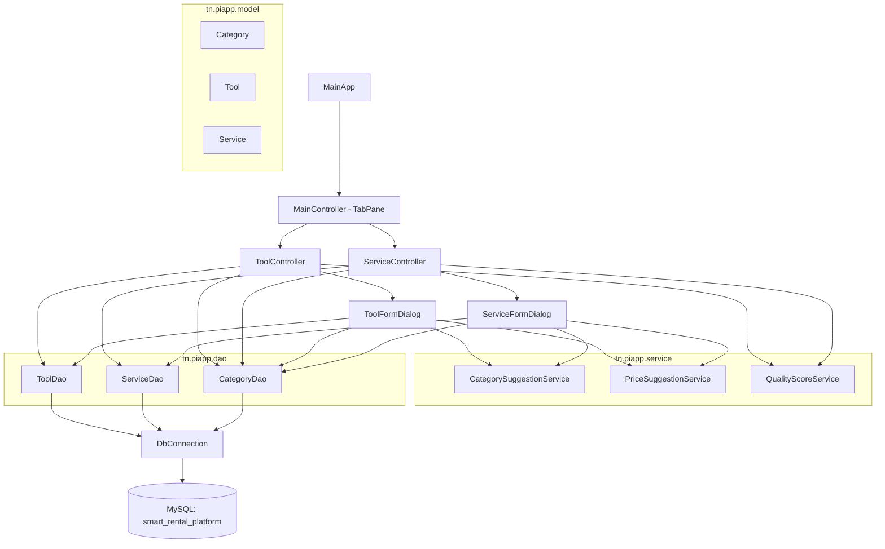

# Design Document: javafx-tools-services-advanced

## Overview

This spec adds six advanced features on top of the existing `javafx-services-tools-crud` application. All features integrate into the existing layered architecture (UI → DAO → DB) without schema changes. The six features build on each other in dependency order:

1. **Category Model + DAO + ComboBox** — foundation; unblocks all other features
2. **Approval Workflow** — per-row Approve/Hide buttons, `setActive` DAO method, 3-way filter toggle
3. **Quality Score** — pure `QualityScoreService`, colored badge in table, detail popup on click
4. **Price Suggestion** — `getPricesByCategory` in DAOs, pure `PriceSuggestionService`, live label in form dialogs
5. **Category Suggestion** — pure `CategorySuggestionService` with keyword map, live suggestion label + Apply button in form dialogs
6. **Advanced Search & Filter** — category/location/price/sort controls, all AND-ed in a single `FilteredList` predicate, `SortedList` for sorting, Clear Filters button

A new sub-package `tn.piapp.service` is introduced for the three pure service classes. No new sub-packages are needed for model or DAO additions.

---

## Architecture



**Layer responsibilities:**

- `tn.piapp.ui` — JavaFX controllers and dialogs; all user interaction and rendering
- `tn.piapp.dao` — SQL execution via JDBC `PreparedStatement`; no business logic
- `tn.piapp.service` — pure, stateless computation classes; no DB access, no JavaFX imports
- `tn.piapp.model` — plain POJOs matching DB columns
- `tn.piapp.db` — single shared `Connection` with validity check and reconnect
- `tn.piapp.util` — stateless helpers: validation and alert dialogs

**Threading model (unchanged from base spec):**

- `findAll()` and `getPricesByCategory()` run inside a JavaFX `Task<T>` on a background thread
- `setActive()`, `insert()`, `update()`, `delete()` are synchronous on the JavaFX Application Thread
- Service classes (`QualityScoreService`, `PriceSuggestionService`, `CategorySuggestionService`) are called synchronously on the JavaFX Application Thread — they are pure in-memory computations with negligible cost

**Filter/sort data flow:**

```
masterList (ObservableList<T>)
    └── FilteredList<T>   ← single combined predicate (text + approval + advanced filters)
            └── SortedList<T>  ← bound to tableView.comparatorProperty()
                    └── TableView<T>
```

All filter controls (text search, approval toggle, category, location, min/max price) update the same `FilteredList` predicate. The sort-by `ComboBox` sets a `Comparator` on the `SortedList` directly; column-header clicks also work because `SortedList` is bound to `tableView.comparatorProperty()`.

---

## Components and Interfaces

### Category (`tn.piapp.model`)

```java
public class Category {
    private int id;
    private String name;
    private String type;   // "tool" or "service"

    public Category() {}
    public Category(int id, String name, String type) { ... }

    public int getId() { return id; }
    public void setId(int id) { this.id = id; }
    public String getName() { return name; }
    public void setName(String name) { this.name = name; }
    public String getType() { return type; }
    public void setType(String type) { this.type = type; }

    @Override public String toString() { return name; }  // for ComboBox display
}
```

### CategoryDao (`tn.piapp.dao`)

```java
public class CategoryDao {
    // SELECT id, name, type FROM category WHERE type = ?
    public List<Category> findByType(String type) throws SQLException;
}
```

### Tool / Service model additions

Both models gain one new nullable field:

```java
// Tool
private Integer categoryId;   // nullable; maps to category_id column
public Integer getCategoryId() { return categoryId; }
public void setCategoryId(Integer categoryId) { this.categoryId = categoryId; }

// Service — identical field name and accessors
```

### ToolDao additions (`tn.piapp.dao`)

```java
// New methods added to existing ToolDao:

// UPDATE tool SET is_active = ? WHERE id = ?
public void setActive(int id, boolean active) throws SQLException;

// SELECT price_per_day FROM tool WHERE category_id = ? AND is_active = 1
public List<BigDecimal> getPricesByCategory(int categoryId) throws SQLException;
```

`findAll`, `insert`, and `update` are updated to include `category_id` in their SQL. New inserts always set `is_active = 0`.

### ServiceDao additions (`tn.piapp.dao`)

```java
// New methods added to existing ServiceDao:

// UPDATE service SET is_active = ? WHERE id = ?
public void setActive(int id, boolean active) throws SQLException;

// SELECT base_price FROM service WHERE category_id = ? AND is_active = 1
public List<BigDecimal> getPricesByCategory(int categoryId) throws SQLException;
```

Same SQL update pattern as `ToolDao`.

### QualityScoreResult (`tn.piapp.service`)

```java
public class QualityScoreResult {
    private final int score;           // 0–100
    private final int percentage;      // score (same value, kept for clarity)
    private final String rating;       // "Excellent" | "Good" | "Needs Improvement"
    private final List<String> suggestions;   // improvement hints
    private final List<String> checklist;     // "✓ Has image" / "✗ No image" etc.

    public QualityScoreResult(int score, String rating,
                               List<String> suggestions, List<String> checklist) { ... }
    // getters only — immutable
}
```

### QualityScoreService (`tn.piapp.service`)

```java
public class QualityScoreService {

    // Scoring constants — Tool
    // imageName non-blank: 30 pts
    // description >= 100 chars: 30 pts; >= 50 chars: 15 pts
    // categoryId non-null: 15 pts
    // location non-blank: 10 pts
    // pricePerDay > 0 && <= 500: 10 pts
    // createdAt within 30 days: 5 pts

    public QualityScoreResult score(Tool tool);

    // Scoring constants — Service
    // imageName non-blank: 30 pts
    // description >= 100 chars: 30 pts; >= 50 chars: 15 pts
    // categoryId non-null: 15 pts
    // location non-blank: 10 pts
    // basePrice > 0 && <= 1000: 10 pts
    // createdAt within 30 days: 5 pts

    public QualityScoreResult score(Service service);
}
```

Rating thresholds: score ≥ 81 → `"Excellent"`, score ≥ 51 → `"Good"`, score < 51 → `"Needs Improvement"`.

### PriceSuggestionResult (`tn.piapp.service`)

```java
public class PriceSuggestionResult {
    private final BigDecimal suggested;  // median, rounded to 2 dp
    private final BigDecimal median;
    private final BigDecimal mean;
    private final BigDecimal min;
    private final BigDecimal max;
    private final int count;
    // getters only — immutable
}
```

### PriceSuggestionService (`tn.piapp.service`)

```java
public class PriceSuggestionService {

    /**
     * Computes price statistics for a non-empty list of prices.
     * Median: middle value (odd count) or average of two middle values (even count) after sorting.
     * Mean: arithmetic mean, rounded to 2 dp.
     * @throws IllegalArgumentException if prices is null or empty
     */
    public PriceSuggestionResult suggest(List<BigDecimal> prices);
}
```

### CategorySuggestionResult (`tn.piapp.service`)

```java
public class CategorySuggestionResult {
    private final Category category;    // null if no match
    private final int confidence;       // 0–100; 0 means no match

    public boolean hasMatch() { return category != null && confidence > 0; }
    // getters only — immutable
}
```

### CategorySuggestionService (`tn.piapp.service`)

```java
public class CategorySuggestionService {

    // Keyword map (category name → keywords):
    // "Plumbing" → [plumb, pipe, leak, drain, faucet, toilet, sink, water]
    // "Electrical" → [electric, wire, light, outlet, switch, circuit, power]
    // "Gardening" → [garden, lawn, plant, tree, grass, hedge, landscape]
    // "Cleaning" → [clean, wash, mop, vacuum, dust, sanitize, tidy]
    // "Painting" → [paint, brush, wall, color, coat, decor]
    // "Moving" → [move, transport, carry, relocate, delivery, haul]
    // "Tutoring" → [tutor, teach, lesson, study, learn, education, homework]
    // "IT Support" → [computer, laptop, software, tech, repair, install, network]
    // "Power Tools" → [drill, saw, grinder, sander, electric tool]
    // "Hand Tools" → [hammer, screwdriver, wrench, pliers, manual tool]
    // "Garden Tools" → [mower, trimmer, rake, shovel, hoe, pruner]
    // "Ladders" → [ladder, step, scaffold, height, climb]
    // "Cleaning Equipment" → [vacuum, pressure washer, carpet cleaner, steam]
    // "Measuring Tools" → [measure, level, tape, ruler, laser]
    // "Outdoor Equipment" → [tent, camping, bbq, grill, outdoor]
    // "Party Equipment" → [party, event, chair, table, decoration, tent]

    /**
     * Scores text against only the categories present in candidates.
     * Keyword map entries whose category name does not match any candidate are ignored.
     * Confidence = round((matchedKeywordCount / totalKeywordsForCategory) * 100).
     * Returns the highest-confidence match, or an empty result if no keywords match.
     * Matching is case-insensitive substring search.
     */
    public CategorySuggestionResult suggest(String text, List<Category> candidates);
}
```

### ToolController / ServiceController additions (`tn.piapp.ui`)

New FXML-injected fields added to each controller:

```java
// Approval workflow
@FXML private ToggleGroup tgApproval;          // All / Active Only / Pending
@FXML private RadioButton rbAll, rbActiveOnly, rbPending;

// Per-row action column (added programmatically, not via FXML)
private TableColumn<Tool, Void> colActions;    // contains Approve/Hide buttons

// Quality score column (added programmatically)
private TableColumn<Tool, Void> colQuality;    // contains colored badge Label

// Advanced filter controls
@FXML private ComboBox<Category> cbCategoryFilter;
@FXML private TextField tfLocationFilter;
@FXML private TextField tfMinPrice;
@FXML private TextField tfMaxPrice;
@FXML private ComboBox<String> cbSortBy;
@FXML private Button btnClearFilters;
```

The single combined predicate method (called whenever any filter changes):

```java
private void updatePredicate() {
    filteredList.setPredicate(item -> {
        // 1. text search (existing)
        // 2. approval toggle (All / Active Only / Pending)
        // 3. category filter
        // 4. location filter (case-insensitive contains)
        // 5. min price
        // 6. max price
        // All conditions AND-ed; invalid numeric inputs are silently ignored
        return textMatch && approvalMatch && categoryMatch
            && locationMatch && minPriceMatch && maxPriceMatch;
    });
}
```

### ToolFormDialog / ServiceFormDialog additions (`tn.piapp.ui`)

New fields added to each dialog:

```java
private ComboBox<Category> cbCategory;
private Label lblPriceSuggestion;
private Label lblCategorySuggestion;
private Button btnApplySuggestion;
```

The `isActive` checkbox is **removed** entirely. New inserts always set `isActive = false` in the DAO.

Category suggestion is triggered by a `ChangeListener` on both `tfName` and `taDescription`. Price suggestion is triggered by a `ChangeListener` on `cbCategory`.

---

## Data Models

### Category (`tn.piapp.model`)

| Field | Java type | DB column | Notes |
|---|---|---|---|
| `id` | `int` | `category.id` | PK |
| `name` | `String` | `category.name` | Display name |
| `type` | `String` | `category.type` | `"tool"` or `"service"` |

### Tool additions

| Field | Java type | DB column | Notes |
|---|---|---|---|
| `categoryId` | `Integer` | `tool.category_id` | Nullable; null if unassigned |

### Service additions

| Field | Java type | DB column | Notes |
|---|---|---|---|
| `categoryId` | `Integer` | `service.category_id` | Nullable; null if unassigned |

### QualityScoreResult

| Field | Java type | Notes |
|---|---|---|
| `score` | `int` | 0–100 |
| `percentage` | `int` | Same as score (score is already out of 100) |
| `rating` | `String` | `"Excellent"` / `"Good"` / `"Needs Improvement"` |
| `suggestions` | `List<String>` | Human-readable improvement hints |
| `checklist` | `List<String>` | `"✓ Has image"` / `"✗ No image"` etc. |

### PriceSuggestionResult

| Field | Java type | Notes |
|---|---|---|
| `suggested` | `BigDecimal` | Median, rounded to 2 dp |
| `median` | `BigDecimal` | Same as suggested |
| `mean` | `BigDecimal` | Arithmetic mean, rounded to 2 dp |
| `min` | `BigDecimal` | Minimum price in list |
| `max` | `BigDecimal` | Maximum price in list |
| `count` | `int` | Number of prices in list |

### CategorySuggestionResult

| Field | Java type | Notes |
|---|---|---|
| `category` | `Category` | Best-matching category; null if no match |
| `confidence` | `int` | 0–100; 0 means no match |

---

## Correctness Properties

*A property is a characteristic or behavior that should hold true across all valid executions of a system — essentially, a formal statement about what the system should do. Properties serve as the bridge between human-readable specifications and machine-verifiable correctness guarantees.*

### Property 1: CategoryDao type filter correctness

*For any* type string (`"tool"` or `"service"`), every `Category` returned by `CategoryDao.findByType(type)` SHALL have its `type` field equal to the argument passed.

**Validates: Requirements 1.2, 1.3, 1.4**

---

### Property 2: categoryId round-trip through DAO

*For any* `Tool` or `Service` with a given `categoryId` value (including `null`), after calling `insert` or `update` followed by `findAll`, the record retrieved from the database SHALL have the same `categoryId` value that was written.

**Validates: Requirements 1.8, 1.9, 1.10, 1.11**

---

### Property 3: New listings always inserted as inactive

*For any* `Tool` or `Service` inserted via `ToolDao.insert` or `ServiceDao.insert`, the record retrieved by a subsequent `findAll` SHALL have `isActive == false`.

**Validates: Requirements 2.1, 2.2**

---

### Property 4: setActive toggles isActive correctly

*For any* existing `Tool` or `Service` record, calling `setActive(id, true)` followed by `findAll` SHALL return that record with `isActive == true`; calling `setActive(id, false)` followed by `findAll` SHALL return that record with `isActive == false`.

**Validates: Requirements 2.7, 2.8, 2.9, 2.10**

---

### Property 5: Approval filter predicate correctness

*For any* in-memory list of `Tool` or `Service` objects with mixed `isActive` values, applying the `Active Only` predicate SHALL return only items where `isActive == true`; applying the `Pending` predicate SHALL return only items where `isActive == false`; applying the `All` predicate SHALL return all items.

**Validates: Requirements 2.15, 2.16, 2.17, 2.18, 2.19, 2.20**

---

### Property 6: Quality score is always in [0, 100]

*For any* valid `Tool` or `Service` object (with any combination of field values), the score returned by `QualityScoreService.score()` SHALL be an integer in the range [0, 100] inclusive.

**Validates: Requirements 3.15, 3.16**

---

### Property 7: Quality score rating matches score range

*For any* `Tool` or `Service`, if `QualityScoreService.score()` returns a score ≥ 81 the rating SHALL be `"Excellent"`, if ≥ 51 and < 81 the rating SHALL be `"Good"`, and if < 51 the rating SHALL be `"Needs Improvement"`.

**Validates: Requirements 3.4, 3.5, 3.6**

---

### Property 8: Quality score equals sum of awarded criteria points

*For any* `Tool` or `Service`, the score returned by `QualityScoreService.score()` SHALL equal the sum of points for each criterion that the object satisfies, according to the point allocation table in Requirements 3.1 and 3.2.

**Validates: Requirements 3.1, 3.2, 3.3**

---

### Property 9: Median is bounded by min and max

*For any* non-empty `List<BigDecimal>` of prices, the `median` and `mean` returned by `PriceSuggestionService.suggest()` SHALL each be ≥ the minimum value and ≤ the maximum value in the list.

**Validates: Requirements 4.10, 4.11**

---

### Property 10: Median computation correctness

*For any* non-empty `List<BigDecimal>` of prices, the `median` returned by `PriceSuggestionService.suggest()` SHALL equal the middle element (odd count) or the average of the two middle elements (even count) after sorting the list in ascending order.

**Validates: Requirements 4.3, 4.4, 4.5**

---

### Property 11: Category suggestion result is always from candidates

*For any* input text and any `List<Category>` candidates, the `Category` returned by `CategorySuggestionService.suggest()` SHALL either be `null` (no match) or be an element present in the `candidates` list — it SHALL never return a category not in `candidates`.

**Validates: Requirements 5.2, 5.4, 5.5**

---

### Property 12: Category suggestion confidence is in [1, 100] when a match exists

*For any* input text that contains at least one keyword from the keyword map for a category present in the candidates list, `CategorySuggestionService.suggest()` SHALL return a confidence value in the range [1, 100] inclusive.

**Validates: Requirements 5.3, 5.13**

---

### Property 13: Category suggestion is case-insensitive

*For any* keyword `k` from the keyword map, `CategorySuggestionService.suggest()` called with `k.toUpperCase()`, `k.toLowerCase()`, and `k` (original case) as the text SHALL all return the same category and the same confidence value.

**Validates: Requirements 5.11**

---

### Property 14: Combined filter predicate AND-correctness

*For any* in-memory list of `Tool` or `Service` objects and any combination of active filter values (text search, approval toggle, category, location, min price, max price), every item in the filtered result SHALL satisfy all active filter conditions simultaneously.

**Validates: Requirements 6.9, 6.10, 6.11, 6.12, 6.13, 6.14, 6.15, 6.16, 6.17, 6.23, 6.25**

---

### Property 15: Sort-by ordering correctness

*For any* non-empty list of `Tool` or `Service` objects and any sort option, the sorted result SHALL be in the correct order: `Date (Newest First)` → descending `createdAt`; `Date (Oldest First)` → ascending `createdAt`; `Price (High to Low)` → descending price; `Price (Low to High)` → ascending price; `Name (A–Z)` → ascending name; `Name (Z–A)` → descending name.

**Validates: Requirements 6.19, 6.20**

---

## Error Handling

| Scenario | Component | Handling |
|---|---|---|
| `CategoryDao.findByType` returns empty list | `ToolFormDialog` / `ServiceFormDialog` | ComboBox shows empty list; no error shown; category remains unselected |
| `CategoryDao.findByType` throws `SQLException` | Controller `initialize()` | Caught in `Task.setOnFailed`; `Alerts.showError()` shown; category ComboBox left empty |
| `ToolDao.setActive` / `ServiceDao.setActive` throws `SQLException` | Controller action button handler | Caught synchronously; `Alerts.showError()` shown; table not refreshed |
| `getPricesByCategory` returns empty list | `ToolFormDialog` / `ServiceFormDialog` | `lblPriceSuggestion` shows "No price data available for this category" |
| `getPricesByCategory` throws `SQLException` | Form dialog category `ChangeListener` | `lblPriceSuggestion` shows "Could not load price data"; no dialog close |
| `PriceSuggestionService.suggest` called with empty list | `ToolFormDialog` / `ServiceFormDialog` | Guarded before call; empty list → show "no data" label instead |
| `CategorySuggestionService.suggest` returns no match | `ToolFormDialog` / `ServiceFormDialog` | `lblCategorySuggestion` and `btnApplySuggestion` set to `setVisible(false)` / `setManaged(false)` |
| Non-numeric value in min/max price filter fields | `ToolController` / `ServiceController` | `NumberFormatException` caught silently in `updatePredicate()`; that filter condition is skipped (treated as inactive) |
| Quality score badge click with null item | `ToolController` / `ServiceController` | Guard `if (item == null) return;` before showing popup |
| DB unreachable during `loadData()` | Controller `Task.setOnFailed` | `Alerts.showError("Load Error", ...)` shown; `masterList` unchanged |

---

## Testing Strategy

### Dual Approach

Both unit tests and property-based tests are required and complementary:
- **Unit tests** cover specific examples, integration points, and edge cases
- **Property tests** verify universal correctness across many generated inputs using **jqwik**

jqwik is already present in `pom.xml` from the base spec. Each property test runs a minimum of **100 tries** (jqwik default is 1000).

### Property Test Tag Format

Each property test must include a comment:
```
// Feature: javafx-tools-services-advanced, Property <N>: <property_text>
```

### Property Tests (one per property)

| Test class | Method | Property |
|---|---|---|
| `CategoryDaoTest` | `findByTypeReturnsOnlyMatchingType()` | Property 1 |
| `ToolDaoTest` / `ServiceDaoTest` | `categoryIdRoundTrip()` | Property 2 |
| `ToolDaoTest` / `ServiceDaoTest` | `newInsertAlwaysInactive()` | Property 3 |
| `ToolDaoTest` / `ServiceDaoTest` | `setActiveTogglesCorrectly()` | Property 4 |
| `ApprovalFilterTest` | `approvalPredicateFiltersCorrectly()` | Property 5 |
| `QualityScoreServiceTest` | `scoreAlwaysInRange()` | Property 6 |
| `QualityScoreServiceTest` | `ratingMatchesScoreRange()` | Property 7 |
| `QualityScoreServiceTest` | `scoreEqualsSumOfCriteria()` | Property 8 |
| `PriceSuggestionServiceTest` | `medianAndMeanBoundedByMinMax()` | Property 9 |
| `PriceSuggestionServiceTest` | `medianComputationCorrect()` | Property 10 |
| `CategorySuggestionServiceTest` | `resultAlwaysFromCandidates()` | Property 11 |
| `CategorySuggestionServiceTest` | `confidenceInRangeWhenMatch()` | Property 12 |
| `CategorySuggestionServiceTest` | `matchingIsCaseInsensitive()` | Property 13 |
| `FilterPredicateTest` | `combinedPredicateAndCorrectness()` | Property 14 |
| `SortOrderTest` | `sortByOrderingCorrect()` | Property 15 |

### Unit Tests

Focus on:
- `CategoryDao.findByType` with unknown type returns empty list (Req 1.5)
- `ToolFormDialog` / `ServiceFormDialog` pre-selects correct `Category` in ComboBox when editing (Req 1.14, 1.15)
- `ToolFormDialog` / `ServiceFormDialog` accepts submission with no category selected and sets `categoryId = null` (Req 1.16)
- `QualityScoreService` returns non-null `suggestions` and `checklist` lists (Req 3.3)
- `PriceSuggestionService.suggest` throws `IllegalArgumentException` for empty list
- `CategorySuggestionService.suggest` returns empty result when no keywords match (Req 5.5)
- `CategorySuggestionService.suggest` ignores keyword map entries not in candidates (Req 5.2)
- `ToolController` / `ServiceController` `onClearFilters()` resets all filter controls to defaults (Req 6.21, 6.22)

### Test Scope Notes

- DAO property tests (Properties 1–4) require a live test database. Use a separate test schema or a test-only MySQL instance. Do not run against the production `smart_rental_platform` database.
- Service class property tests (Properties 5–15) are pure in-memory and require no database.
- Filter predicate tests (Properties 5, 14, 15) test pure Java `Predicate<T>` and `Comparator<T>` logic extracted from the controllers — extract these into testable static methods or helper classes to avoid requiring a JavaFX runtime in tests.
